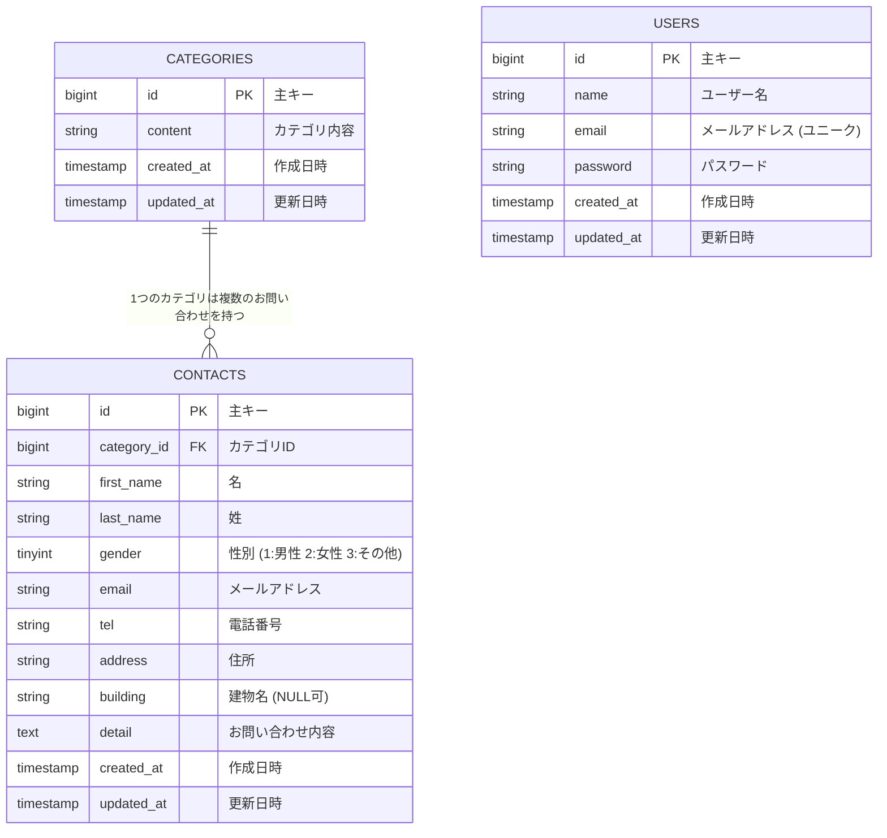

# ER 図 - お問い合わせフォーム システム

## テーブル構造とリレーションシップ

## テーブル詳細

### 📋 CATEGORIES テーブル

お問い合わせの種類を管理するマスターテーブル

| カラム名   | データ型     | 制約                        | 説明         |
| ---------- | ------------ | --------------------------- | ------------ |
| id         | bigint       | PRIMARY KEY, AUTO_INCREMENT | 主キー       |
| content    | varchar(255) | NOT NULL                    | カテゴリ内容 |
| created_at | timestamp    | NULL                        | 作成日時     |
| updated_at | timestamp    | NULL                        | 更新日時     |

### 📝 CONTACTS テーブル

お問い合わせ情報を格納するメインテーブル

| カラム名    | データ型     | 制約                        | 説明                            |
| ----------- | ------------ | --------------------------- | ------------------------------- |
| id          | bigint       | PRIMARY KEY, AUTO_INCREMENT | 主キー                          |
| category_id | bigint       | FOREIGN KEY, NOT NULL       | カテゴリ ID                     |
| first_name  | varchar(255) | NOT NULL                    | 名                              |
| last_name   | varchar(255) | NOT NULL                    | 姓                              |
| gender      | tinyint      | NOT NULL                    | 性別 (1:男性, 2:女性, 3:その他) |
| email       | varchar(255) | NOT NULL                    | メールアドレス                  |
| tel         | varchar(255) | NOT NULL                    | 電話番号                        |
| address     | varchar(255) | NOT NULL                    | 住所                            |
| building    | varchar(255) | NULLABLE                    | 建物名                          |
| detail      | text         | NOT NULL                    | お問い合わせ内容                |
| created_at  | timestamp    | NULL                        | 作成日時                        |
| updated_at  | timestamp    | NULL                        | 更新日時                        |

### 👤 USERS テーブル

管理者ユーザー情報を格納するテーブル

| カラム名   | データ型     | 制約                        | 説明                     |
| ---------- | ------------ | --------------------------- | ------------------------ |
| id         | bigint       | PRIMARY KEY, AUTO_INCREMENT | 主キー                   |
| name       | varchar(255) | NOT NULL                    | ユーザー名               |
| email      | varchar(255) | UNIQUE, NOT NULL            | メールアドレス           |
| password   | varchar(255) | NOT NULL                    | パスワード（ハッシュ化） |
| created_at | timestamp    | NULL                        | 作成日時                 |
| updated_at | timestamp    | NULL                        | 更新日時                 |

## リレーションシップ

### 🔗 CATEGORIES → CONTACTS (1:N)

- **関係**: 1 つのカテゴリは複数のお問い合わせを持つ
- **外部キー**: `contacts.category_id` → `categories.id`
- **制約**: `FOREIGN KEY CONSTRAINT`

## インデックス情報

### 主キーインデックス

- `categories.id` (PRIMARY KEY)
- `contacts.id` (PRIMARY KEY)
- `users.id` (PRIMARY KEY)

### 外部キーインデックス

- `contacts.category_id` (FOREIGN KEY)

### ユニークインデックス

- `users.email` (UNIQUE)

## ビジネスルール

1. **カテゴリ**: お問い合わせは必ず 1 つのカテゴリに属する
2. **性別**: 1(男性), 2(女性), 3(その他) の値のみ許可
3. **建物名**: 任意項目（NULL 許可）
4. **メールアドレス**: ユーザーテーブルでは重複不可
5. **タイムスタンプ**: 全テーブルで作成・更新日時を自動管理

## システム概要

この ER 図は「お問い合わせフォーム」システムのデータベース設計を表しています：

- **CATEGORIES**: お問い合わせの種類（商品について、配送について等）
- **CONTACTS**: 顧客からのお問い合わせ内容
- **USERS**: 管理者アカウント（お問い合わせ管理用）

主要な機能：

- 📝 お問い合わせの登録
- 🔍 お問い合わせの検索・絞り込み
- 📊 お問い合わせ一覧表示
- 🗑️ お問い合わせの削除
- 📤 CSV エクスポート機能
