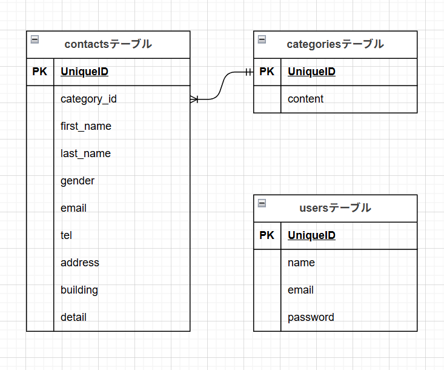

# お問い合わせフォーム

## 環境構築

### Docker ビルド

1.  git clone git@github.com:LesserPand8/conf-test.git
1.  docker-compose up -d --build

＊MYSQL は、OS によって起動しない場合があるのでそれぞれの PC に合わせて docker-conpose.yml ファイルを編集してください。

### Laravel 環境構築

1. docker-compose exec php bash
1. composer install
1. cp .env.example .env
1. php artisan key:generate
1. php artisan migrate
1. php artisan db:seed

## 使用技術(実行環境)

- Laravel 8.x
- php 8.1
- MySQL 8.0

## ER 図

## URL

- 開発環境：http://localhost/
- phpMyAdmin：http://localhost:8080/
